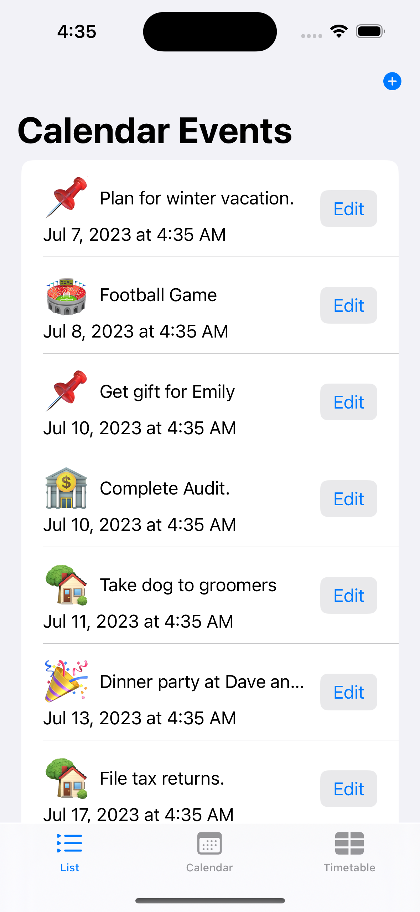
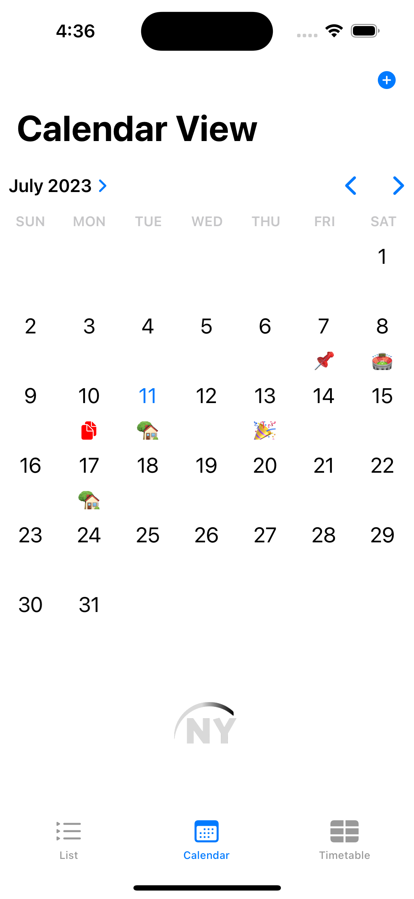

# Uni Calendar iOS App

The Uni Calendar iOS app is a powerful tool designed to help users manage their events, stay organized with a calendar, and keep track of their class schedule. With a user-friendly interface and intuitive features, the app simplifies event management and scheduling tasks, making it an essential companion for individuals with busy lives.

## Screenshots

| ||

## Key Features

1. Event Management: The app allows users to create, view, edit, and delete events effortlessly. Users can provide event details such as the title, date, time, location, and notes. The List Tab provides a convenient way to manage events in a list format, while the Calendar Tab offers a visual representation of events for better planning.

2. Calendar Integration: The calendar feature enables users to view their events in a monthly, weekly, or daily format. Events added or modified in the List Tab are automatically synced and displayed in the Calendar Tab, ensuring seamless updates across both views. Users can easily navigate through dates, add new events directly on the calendar, and set reminders to stay on top of their schedules.

3. Class Schedule Management: The app includes a dedicated Class Schedule Tab that allows users to organize and track their classes. Users can add class details such as the name, time, day, duration, and location. The class schedule is displayed in a visually appealing timetable format, providing a clear overview of the weekly class schedule. Users can add, edit, and delete classes, ensuring they never miss an important session.

4. Intuitive User Interface: The app features a clean and intuitive user interface that prioritizes simplicity and ease of use. The tab-based navigation system ensures smooth switching between different functionalities. Users can effortlessly add, edit, or delete events and classes with just a few taps. The color-coded interface enhances visual organization and distinguishes between different types of events.

## Start Tab View
The app consists of three main tabs accessible from the Start Tab View.

### List Tab
The List Tab displays a list of events. Events can be added, edited, or deleted using this tab. Any changes made to an event in the List Tab will be automatically reflected in the Calendar Tab.

### Calendar Tab
The Calendar Tab provides a visual representation of events on a calendar. It allows users to add, remove, and edit events directly on the calendar. Additionally, users can set reminders for their events.

### Class Schedule Tab
The Class Schedule Tab allows users to manage their class schedule. Users can add classes by providing information such as the class name, time, day, duration, and location. The added classes are displayed in a timetable format, making it easy to track and manage class schedules.

## Preview
The app is currently under production. However, here are some screenshots of the app and its features.

## Requirements
- iOS device running iOS version 15.0 or above.

## Contributions
Contributions to the app are welcome! Please contact the app's developer at `ninar@ninaryoukhanna.pl`.

## Contact
For any inquiries or support, please contact the app's developer at `ninar@ninaryoukhanna.pl`.
